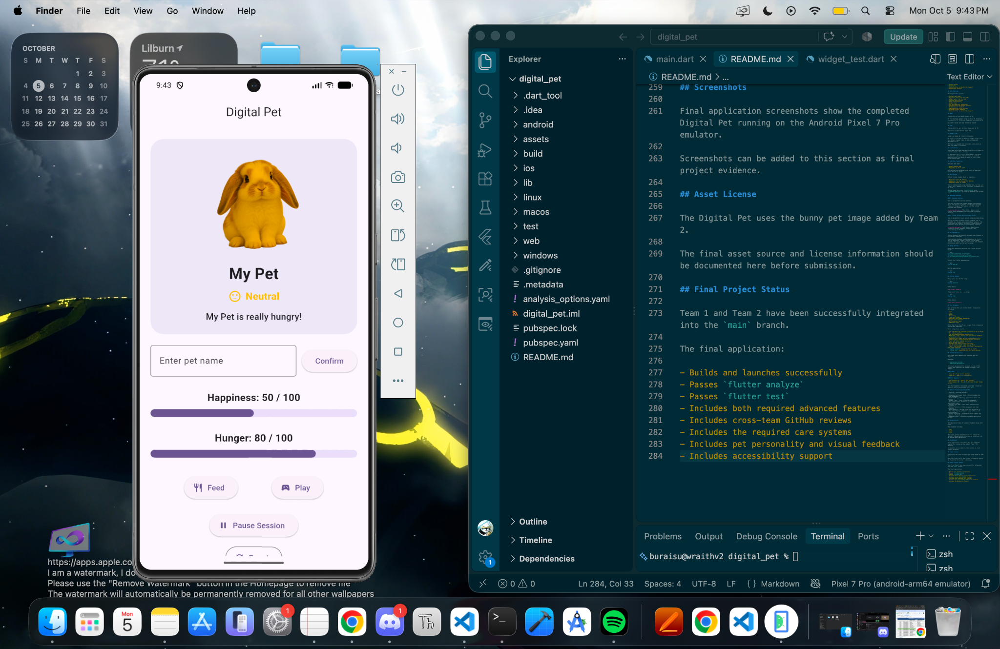
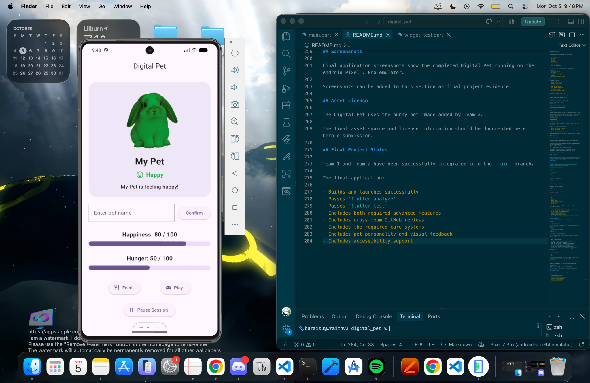
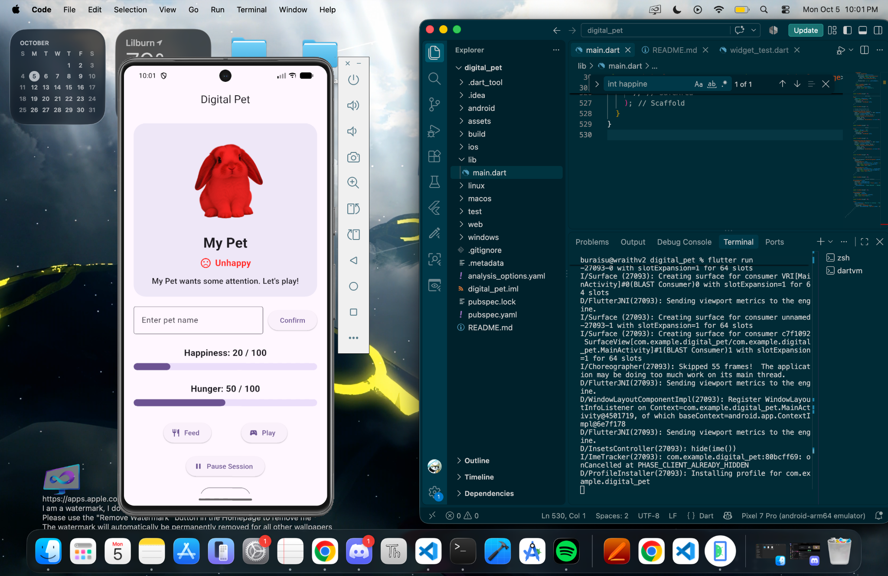

# Digital Pet - In-Class Activity 07

This project is a Digital Pet application created with Flutter for In-Class Activity 07. The app uses state management, timers, user interactions, animations, and visual feedback to simulate taking care of a virtual pet.

## Team Members

- Bryce Lwood - Team 1: Care Systems
- Nour Khoulania - Team 2: Pet Personality

## Team Responsibilities

### Team 1 - Care Systems

Bryce worked on the main pet care and game state systems.

Responsibilities:

- Happiness and hunger state
- Feed action
- Play action
- Reset functionality
- Hunger timer
- Win condition
- Game-over condition
- Editable pet name
- Session Controls
- State boundary handling
- Testing care system behavior

### Team 2 - Pet Personality

Nour worked on the pet personality and visual feedback systems.

Responsibilities:

- Pet personality messages
- Mood feedback
- Pet image and visual presentation
- ColorFiltered mood tinting
- Visual polish
- Animations
- Reduced-motion accessibility support
- Interaction testing

## Core Features

The Digital Pet includes:

- Editable pet name
- Happiness meter from 0 to 100
- Hunger meter from 0 to 100
- Feed and Play actions
- Reset functionality
- Hunger timer
- Win and game-over conditions
- Session pause and resume controls
- Mood-based pet feedback
- Mood-based pet color tinting
- Animated visual feedback
- Reduced-motion accessibility support

## Feed

Feeding the pet decreases hunger by 10.

If the resulting hunger value is below 30, happiness increases by 20. Otherwise, happiness increases by 10.

All meter values are kept between 0 and 100.

## Play

Playing with the pet increases happiness by 10.

Happiness is kept between 0 and 100.

## Hunger Timer

Hunger increases by 5 every 30 seconds.

If hunger is already at 100 when another hunger timer tick occurs, hunger stays at 100 and happiness decreases by 20.

The timer is stopped when necessary and cleaned up when the widget is disposed.

## Win Condition

The player wins when happiness stays strictly above 80 continuously for three minutes.

If happiness falls to 80 or below before the three minutes are complete, the win timer is canceled. Happiness must rise above 80 again to start a new three-minute timer.

## Game Over Condition

The game ends when:

- Hunger reaches 100
- Happiness is 10 or lower

Care actions are disabled after a win or game over until the pet is reset.

## Mood System

The pet's mood changes based on happiness.

- Happiness below 30: Unhappy
- Happiness from 30 through 70: Neutral
- Happiness above 70: Happy

Mood is communicated using readable text, an icon, and visual color feedback so the mood does not depend only on color.

The pet image also uses `ColorFiltered` with `BlendMode.modulate` to visually represent the current mood.

## Advanced Features

### 1. Session Controls

Team 1 implemented Session Controls.

The user can pause and resume the pet-care session. While the session is paused, care actions and game timers are stopped. The session can then safely continue when resumed.

**Learning Outcome:** This feature demonstrates Flutter state management and safe timer lifecycle handling.

### 2. Visual Polish and Accessible Motion

Team 2 implemented visual polish and accessible motion.

The app includes animated visual feedback such as animated pet changes and animated meter updates. The interface also respects the device's reduced-motion preference using Flutter's accessibility settings.

**Learning Outcome:** This feature demonstrates responsive visual feedback, animation, and accessibility in Flutter.

## Pet Personality

The pet displays personality messages that respond to its current condition.

The displayed feedback changes depending on factors such as happiness, hunger, and the current game outcome. This gives the user both visual and readable information about how the pet is doing.

## Setup and Run

Clone the repository and enter the Flutter project folder.

```bash
git clone git@github.com:bdlwood1/In-Class-Activity-07-Digital-Pet.git
cd In-Class-Activity-07-Digital-Pet/digital_pet
```

Install the Flutter dependencies:

```bash
flutter pub get
```

Run the application:

```bash
flutter run
```

## Flutter Checks

The project was checked using:

```bash
flutter analyze
```

Final result:

**No issues found.**

The project tests were run using:

```bash
flutter test
```

Final result:

**All tests passed.**

## Test Evidence

Team 1 tested the care systems before integration, including:

- Feed
- Play
- Reset
- Pet naming
- Pause and resume
- Happiness and hunger boundaries
- Hunger timer behavior
- Win-condition logic
- Game-over logic

After Team 1 and Team 2 were merged, final integrated testing was completed.

Final integration results:

- The completed app launched successfully on the Pixel 7 Pro Android emulator.
- The pet image displayed successfully.
- Mood text, icons, colors, and personality feedback displayed correctly.
- Happiness and hunger meters displayed correctly.
- Feed and Play worked with the merged interface.
- Pause and Resume worked correctly.
- Reset worked correctly.
- Editable pet naming worked correctly.
- The 30-second hunger timer was verified.
- Team 1 care systems worked with Team 2 personality and visual features.
- `flutter analyze` completed with no issues.
- `flutter test` completed with all tests passing.

## GitHub Collaboration

Both teams used separate Git branches and Pull Requests.

Branches:

- `team-1/care-systems`
- `team-2/pet-personality`

Each team implemented its assigned portion of the project and submitted the changes through a Pull Request.

### Issues

- Issue #2 - Team 1: Care Systems
- Issue #3 - Team 2: Pet Personality

### Pull Requests

- Pull Request #1 - Team 1 Care Systems
- Pull Request #4 - Team 2 Pet Personality and Visual Polish

Both Pull Requests received a cross-team review and approval before being merged into `main`.

## Feature-to-Learning-Outcome Map

| Feature | Learning Outcome |
| --- | --- |
| Happiness and Hunger State | StatefulWidget and state management |
| Feed and Play | Updating application state with setState |
| Hunger Timer | Timer lifecycle management |
| Win and Game-Over Conditions | State-based application logic |
| Editable Pet Name | User input and controller management |
| Session Controls | State management and timer lifecycle |
| Mood Feedback | Derived state and responsive UI |
| Pet Color Tinting | Flutter visual effects with ColorFiltered |
| Visual Animations | Animated Flutter widgets and responsive feedback |
| Reduced Motion | Accessibility-aware application design |

## Accessibility

The application does not communicate mood using color alone.

Mood feedback includes:

- Text
- Icons
- Color

The visual polish implementation also checks the device's reduced-motion preference so animations can be reduced when appropriate.

## Screenshots

Final application screenshots show the completed Digital Pet running on the Android Pixel 7 Pro emulator.

### Neutral Mood

The Neutral state is shown when happiness is between 30 and 70. The pet uses a yellow tint, a neutral icon, and readable mood text.



### Happy Mood

The Happy state is shown when happiness is above 70. The pet uses a green tint, a happy icon, and readable mood text.



### Unhappy Mood

The Unhappy state is shown when happiness is below 30. The pet uses a red tint, an unhappy icon, and readable mood text.



## Asset Source and License

The bunny image used for the Digital Pet was found by Team 2 on Pinterest.

No specific license information was available with the image, and the original creator could not be identified from the available source information.

The image is used in this project for educational coursework only.

## Final Project Status

Team 1 and Team 2 have been successfully integrated into the `main` branch.

The final application:

- Builds and launches successfully
- Passes `flutter analyze`
- Passes `flutter test`
- Includes both required advanced features
- Includes cross-team GitHub reviews
- Includes the required care systems
- Includes pet personality and visual feedback
- Includes accessibility support
- Includes final application screenshots